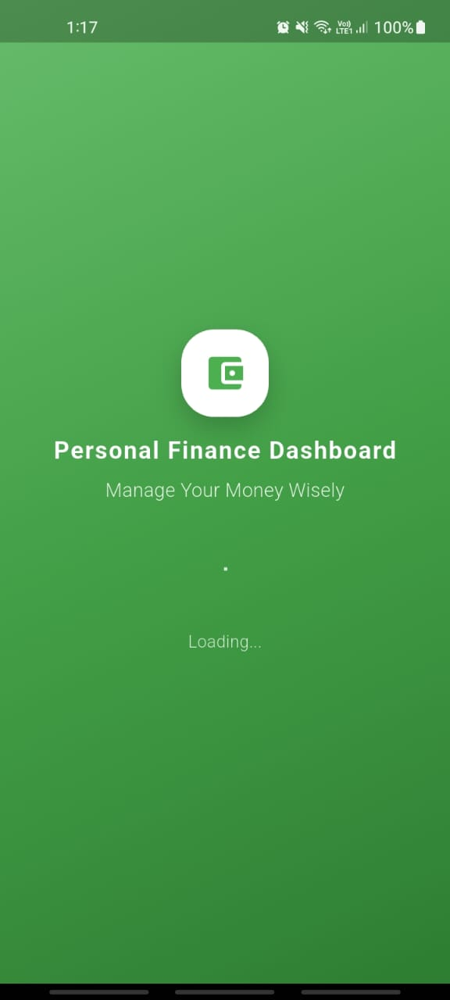
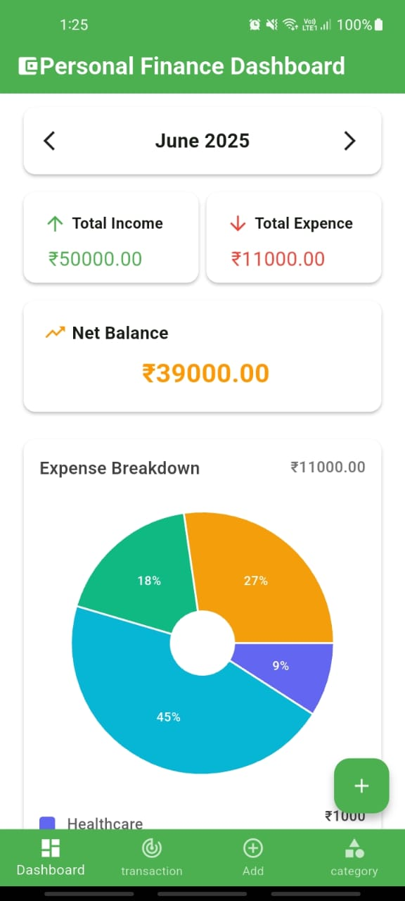
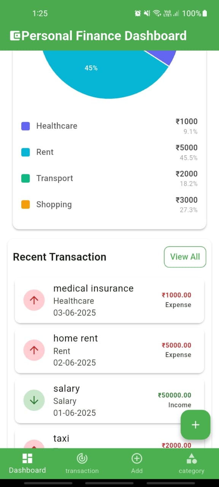
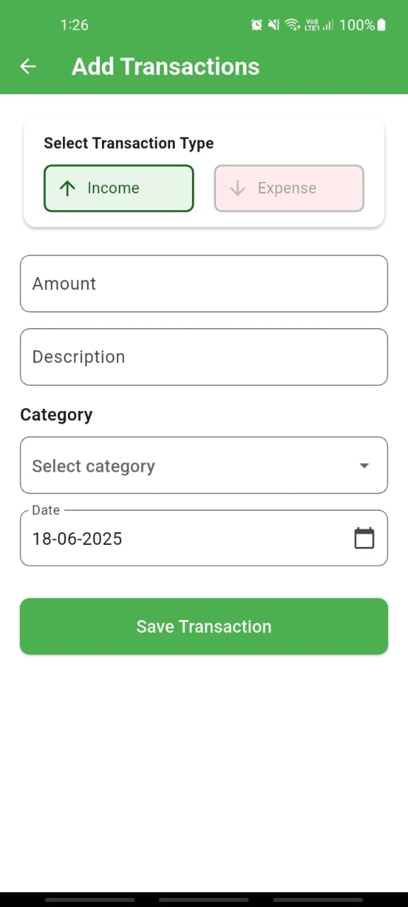
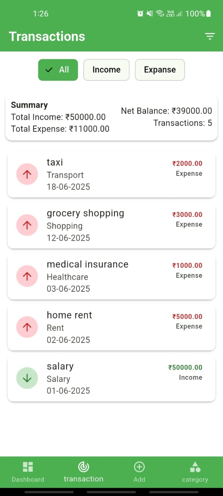
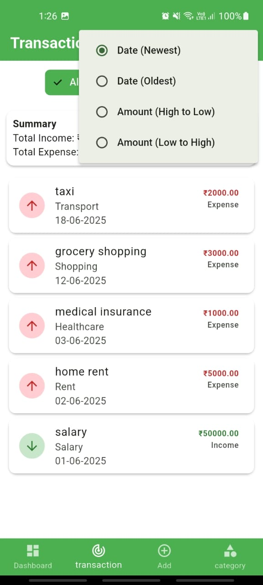
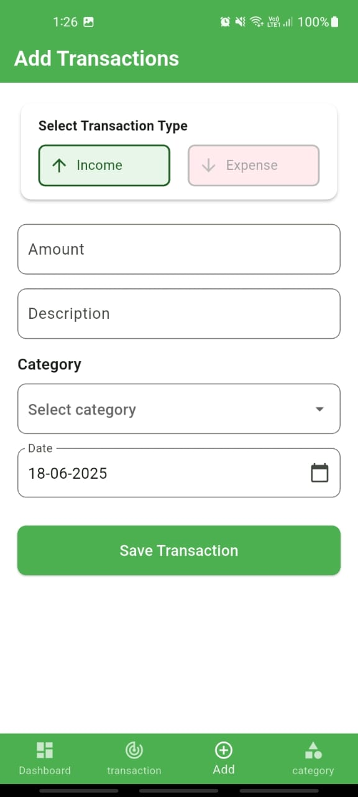
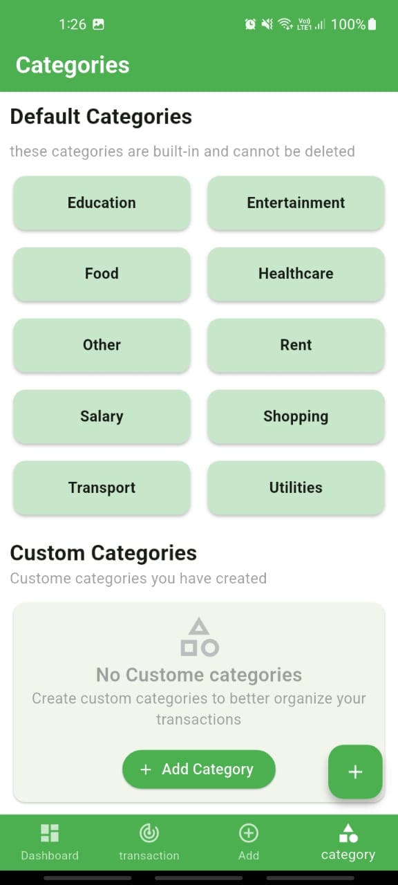
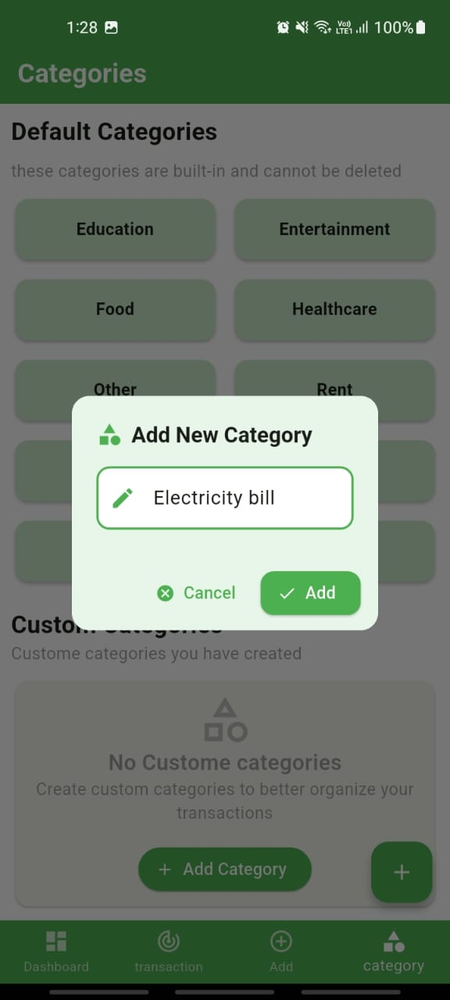
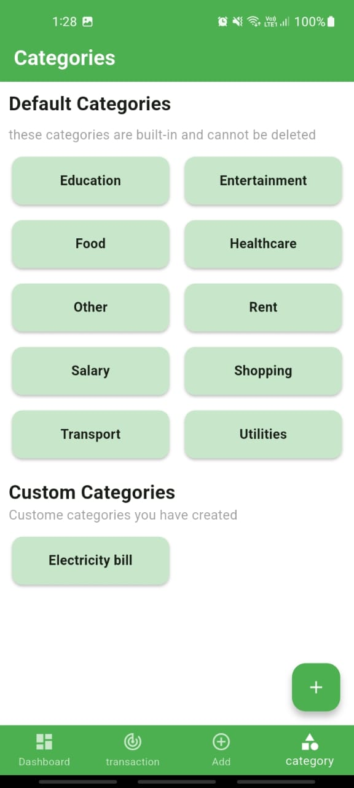

# Personal Finance Dashboard

A Flutter application for managing personal finances, tracking income and expenses, and visualizing financial data.

## ✨ Features

- **Dashboard:** An overview of your total income, expenses, and net balance for the selected month.
- **Expense Breakdown:** A pie chart to visualize your expenses by category.
- **Transaction Management:** Add, view, filter, and sort your income and expense transactions.
- **Categories:** Manage default and custom categories for your transactions.
- **Monthly Reports:** View your financial summary on a monthly basis.

## 📸 Screenshots

*To add your screenshots, create an `assets/images` folder in your project, add your images there, and then update the paths below.*

| Splash Screen | Dashboard |  | Add Transaction | Transactions List |
|:---:|:---:|:---:|:---:|:---:|
|  |  |  |  |  | 

|  | Add Transactions | Categories | Add New Category |  |
|:---:|:---:|:---:|:---:|:---:|
|  |  |  |  |  |


## 🎥 Video Demo

*To add a video demo, record a GIF or a short video of your app in action, add it to the `assets` folder, and update the path below.*

https://drive.google.com/file/d/1St-p6_7mAbvnhd9U9lvKVMBc1hl5qZgv/view?t=100

)


## 🚀 Setup and Installation

To get the project up and running on your local machine, follow these steps:

1.  **Prerequisites:** Make sure you have the [Flutter SDK](https://flutter.dev/docs/get-started/install) installed.
2.  **Clone the repository:**
    ```sh
    git clone https://github.com/your-username/my_pfd.git
    ```
3.  **Navigate to the project directory:**
    ```sh
    cd my_pfd
    ```
4.  **Install dependencies:**
    ```sh
    flutter pub get
    ```
5.  **Run the application:**
    ```sh
    flutter run
    ```

## 🛠️ State Management

This project uses **GetX** for state management. Here's why it was chosen:

- **Simplicity and Lightweight:** GetX provides a simple and intuitive syntax for state management without requiring a lot of boilerplate code. It's lightweight and doesn't add unnecessary overhead to the application.
- **Decoupled Architecture:** It helps in decoupling the view from the business logic. By using controllers, the UI widgets are kept clean and focused on rendering, while the controllers handle the application's state and logic.
- **Built-in Dependency Injection:** GetX has a simple and powerful dependency injection system, making it easy to manage controllers and other dependencies throughout the application.

## ⚙️ Implementation of Challenging Features

Here's a brief description of how some of the more challenging features were implemented:

- **Filtering and Sorting:**
  - On the `TransactionListScreen`, users can filter transactions by type (All, Income, Expense) and sort them. This is achieved by using a `TransactionListScreenController` that holds the state for the selected filter and sort options. The UI uses `Obx` to reactively rebuild when these options change, and the controller applies the filtering and sorting logic to the transaction list before it's displayed.

- **Monthly Summary:**
  - The `DashboardScreen` displays a summary for a selected month. This is managed by two controllers: `MonthSelectorController` for handling the logic of changing months and `DashboardController` for fetching and calculating the financial data for the selected month from the local database.

- **Custom Categories:**
  - The `CategoriesScreen` allows users to add their own custom categories. These are stored in the local SQLite database. A dialog is used to get the new category name from the user, and the `CategoryController` handles the logic of saving the new category to the database and updating the UI.

## 📝 Assumptions and Limitations

- **Assumptions:**
  - It is assumed that the user will be running the application on a mobile device (Android or iOS).
  - The data is stored locally on the device, and there is no cloud synchronization.

- **Known Limitations:**
  - **No Cloud Backup:** All data is stored locally. If the app is uninstalled, the data will be lost.
  - **Single Currency:** The application currently supports only one currency (INR).
  - **No User Authentication:** There is no user login or authentication system.

## ⚖️ License

This project is proprietary and all rights are reserved. You may not use, copy, modify, or distribute this project without explicit permission from the owner.

A new Flutter project.

## Getting Started

This project is a starting point for a Flutter application.

A few resources to get you started if this is your first Flutter project:

- [Lab: Write your first Flutter app](https://docs.flutter.dev/get-started/codelab)
- [Cookbook: Useful Flutter samples](https://docs.flutter.dev/cookbook)

For help getting started with Flutter development, view the
[online documentation](https://docs.flutter.dev/), which offers tutorials,
samples, guidance on mobile development, and a full API reference.
